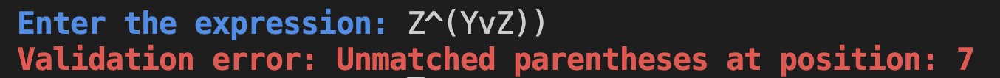

# Logical Expression Solver

This project is a **Java-based Logical Expression Evaluator** that validates, processes, and evaluates logical expressions. It provides an interface for users to input logical expressions involving variables, operators (`~`,**`^`,** **`v`,** `>`), and outputs the evaluation result based on user-provided values for each variable.

## Features

- **Expression Validation**: Ensures the logical expression is syntactically correct.
- **Customizable Variables**: Allows users to assign boolean values (`true` or `false`) to variables.
- **Infix to Postfix Conversion**: Converts infix logical expressions to postfix for evaluation.
- **Logical Operators**:

  - **`~`**: NOT
  - **`^`**: AND
  - **`v`**: OR
  - **`>`**: Implies

- **Color-Coded Output**: Provides colored feedback for validation and result, enhancing readability.

## Project Structure

- `Colors`: Contains ANSI escape codes for colored terminal output.
- `Expression` and `LogicalExpressionSolver` (Interfaces): Define a structure for handling logical expressions.
- `LogicalExp` (Class): Implements `Expression`, storing and handling logical expressions.
- `EvaluateExp` (Class): Implements `LogicalExpressionSolver`, handling the evaluation process from validation to postfix evaluation.
- `LogicalExpressionsEvaluator` (Main Class): Entry point of the application, gathering user input and initiating the evaluation.

## Getting Started

### Prerequisites

- **Java 8 or higher**

### Running the Program

1. **Clone the Repository**:

   ```
   git clone https://github.com/omarzydan610/LogicalExpressionsEvaluator.git
   ```

2. **Navigate to the Project Directory**:

   ```
   cd LogicalExpressionEvaluator
   ```

3. **Compile and Run**:

   ```javac
   javac LogicalExpressionEvaluator.java
   java LogicalExpressionEvaluator
   ```

## Example Usage

- After launching the application, enter a logical expression using variables and logical operators.
- For instance:

  ```
  (A > B) ^ (C v ~D)
  ```

- The program will prompt you to assign boolean values to each variable:

  ```
  Please enter the value of A (true/false):
  Please enter the value of B (true/false):
  Please enter the value of C (true/false):
  Please enter the value of D (true/false):
  ```

### Sample Output

Upon successful evaluation, the program will output:

```
Expression is valid.
Output: true
```

### Error Handling

If the expression is invalid, the program will display a validation error with a descriptive message:

```
Validation error: Expression ends with an operator.
```

## Project Highlights

- **Validation Logic**: Checks for unmatched parentheses, consecutive operators, and other common logical errors.
- **Postfix Evaluation**: Efficiently processes postfix expressions with stack-based evaluation.

## Sample Runs




